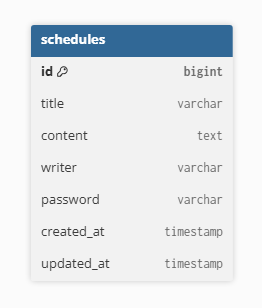

# 일정 관리 API 명세서 (간단 버전)

## 기본 정보
- Base URL: http://localhost:8080
- 리소스: schedules
- Content-Type: application/json
- 작성/수정일 형식: 2025-11-03T13:45:12+09:00
- 수정/삭제 시 비밀번호 필요

---

## 데이터 구조
{
"id": 1,
"title": "회의",
"content": "백엔드 회의",
"writer": "민상",
"createdAt": "2025-11-03T13:45:12+09:00",
"updatedAt": "2025-11-03T13:50:40+09:00"
}

※ id, createdAt, updatedAt은 서버에서 자동 생성  
※ password는 저장되지만 응답에는 포함되지 않음

---

## 1. 일정 전체 조회
- Method: GET
- URL: /schedules

응답 예시 
```
{
"content": [
{
"id": 3,
"title": "회의",
"content": "백엔드",
"writer": "민상",
"createdAt": "2025-11-03T13:40:00+09:00",
"updatedAt": "2025-11-03T13:40:00+09:00"
}
]
}
```
---

## 2. 일정 등록
- Method: POST
- URL: /schedules

요청 예시  
```
{
"title": "회의",
"content": "백엔드 회의",
"writer": "민상",
"password": "1234"
}
```

응답 예시 (201 Created)  
```
{
"id": 5,
"title": "회의",
"content": "백엔드 회의",
"writer": "민상",
"createdAt": "2025-11-03T13:45:12+09:00",
"updatedAt": "2025-11-03T13:45:12+09:00"
}
```
---

## 3. 일정 단일 조회
- Method: GET
- URL: /schedules/{writer}

---

## 4. 일정 수정
- Method: PUT
- URL: /schedules/{writer}

요청 예시  
```
{
"title": "회의(수정)",
"content": "백엔드 회의 안건 정리",
"password": "1234"
}
```
---

## 5. 일정 삭제
- Method: DELETE
- URL: /schedules/{id}

요청 예시  
```
{
"password": "1234"
}
```
---

## 에러 응답
{
"error": "Unauthorized",
"message": "비밀번호가 올바르지 않습니다."
}

---
## ERD

